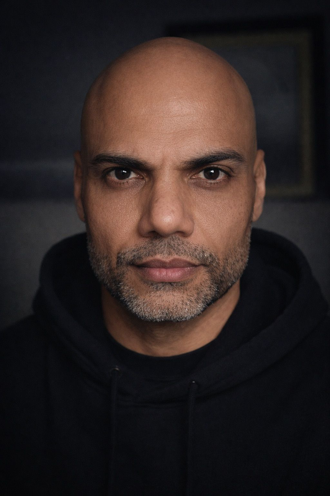

{width=200px}

# Pramod Kumar

### MBA | AI Applications in Business | Cisco Unified Collaboration Specialist

📧 pk.narain129@yahoo.com  
📱 +1 (236) 339-7049  
🌍 Canada

---

# 👋 About Me

I am an MBA graduate specializing in Artificial Intelligence applications in business and marketing, with over 15 years of experience in IT infrastructure and voice collaboration engineering.

My professional focus lies at the intersection of technology and strategy — leveraging AI-driven insights, voice and video collaboration platforms, and digital solutions to create measurable business value for organizations.

I have worked extensively on enterprise communication technologies including Cisco Unified Communications, Avaya systems, compliance recording platforms such as NICE and Verint, and modern collaboration technologies including Microsoft Teams and Zoom.

---

# 🎓 Education

## Master of Business Administration (MBA)

Specialization: Artificial Intelligence Applications in Business & Marketing  
Institution: University Canada West  
Location: Canada  

## Technical Background

Bachelor’s in Telecommunications Engineering  
Diploma in Electronics Engineering

My academic and technical background allows me to combine business strategy with deep technical expertise in enterprise communication systems.

---

# 🚀 Professional Vision

My goal is to bridge business strategy and emerging technologies by helping organizations adopt AI-driven systems securely and strategically.

I aim to contribute to innovation-focused environments where data, cybersecurity, voice collaboration systems, and business intelligence intersect.